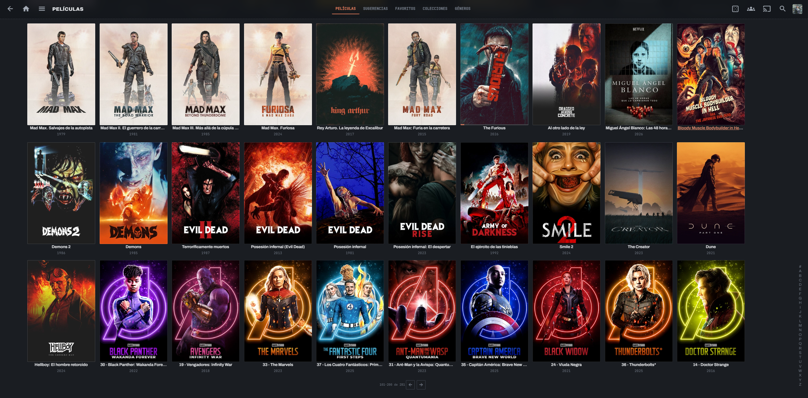

# Dashline

A minimal dark theme for [Jellyfin](https://jellyfin.org). Slate background, an orange accent, dashed hairlines, and poster cards with thin frames. The look borrows from film-diary apps and dashboard UIs.



> Pure CSS. No plugins, no server changes. Works with Jellyfin Web **10.9, 10.10 and 10.11**.

---

## Features

- **Dashed dividers** under section titles, details, lists, dialogs and the sidebar
- **Framed posters**: a 1px border that turns into a 2px accent outline on hover or focus (works with TV and remote navigation)
- **Orange accent** (`#d97757`) on Play, the active sidebar item, progress bars, played badges, sliders, toggles and checkboxes
- **Typography**: uppercase *Archivo* headings with *JetBrains Mono* for metadata, labels and timestamps
- **Square corners** (2px radius) everywhere
- **Full coverage**: home, libraries, detail pages, dialogs, action sheets, the now-playing bar, the video OSD, login and the admin dashboard (including the new React/MUI dashboard)
- **Accessible**: visible focus rings, AA-contrast text, `prefers-reduced-motion` support

## Installation

### Option A — Remote import (recommended, gets updates automatically)

1. Open **Dashboard → Branding** (on Jellyfin ≤ 10.8: **Dashboard → General**).
2. In **Custom CSS code**, paste:

   ```css
   @import url('https://cdn.jsdelivr.net/gh/lethamburn/dashline@main/dashline.css');
   ```

3. Click **Save**, then hard-refresh (`Ctrl/Cmd + Shift + R`).

To pin a version, replace `@main` with a tag (for example `@v1.0.0`).

### Option B — Paste the whole file

Copy the full contents of [`dashline.css`](dashline.css) into **Custom CSS code** and save. The `@import` for the fonts has to stay on the first line.

### Per-user install

Each user can apply the theme on their own account under **Profile → Display → Custom CSS code**.

### Recommended settings

- **Profile → Display → Theme:** `Dark`
- **Profile → Home → Backdrops:** optional. The theme dims backdrops so text stays readable.

## Customization

All colors and fonts are CSS variables. Add overrides **below** the import:

```css
:root {
  --dl-accent: #d97757;        /* main accent */
  --dl-accent-hover: #e58e70;
  --dl-accent-ink: #1a120e;    /* text on accent */
  --dl-bg: #1a1d22;            /* page background */
  --dl-surface: #23272e;       /* cards, dialogs */
  --dl-steel: #7884ab;         /* secondary buttons */
  --dl-radius: 2px;
  --dl-font: 'Archivo', sans-serif;
  --dl-mono: 'JetBrains Mono', monospace;
}
```

Example accents:

| Accent | `--dl-accent` | `--dl-accent-hover` |
|---|---|---|
| Orange (default) | `#d97757` | `#e58e70` |
| Lime | `#b4f06c` | `#c8f78f` |
| Sky | `#4fc1f0` | `#7dd2f5` |

## Compatibility

| Client | Status |
|---|---|
| Jellyfin Web (browser) | ✅ Full |
| Jellyfin Media Player (desktop) | ✅ Full |
| Android / Android TV app | ✅ Webview-based screens |
| iOS (Swiftfin), Roku, native TV apps | ❌ These apps don't support custom CSS |

## Uninstall

Clear the **Custom CSS code** field, save, and refresh.
